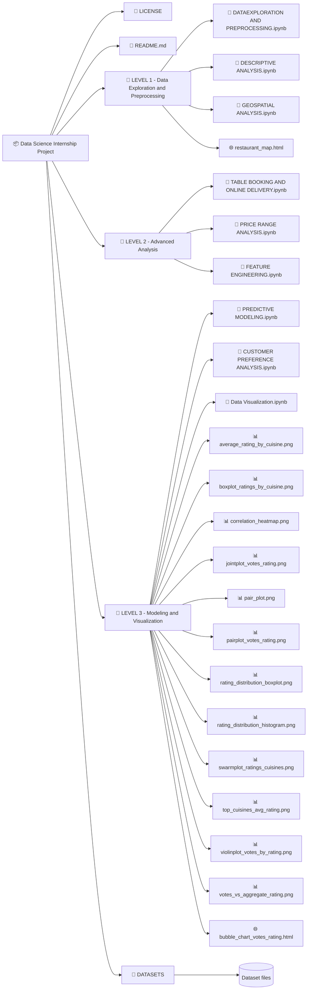

```
📦 Data Science Internship Project
│
├── 📄 LICENSE
├── 📄 README.md
│
├── 📁 LEVEL 1 - Data Exploration and Preprocessing
│   ├── 📄 DATAEXPLORATION AND PREPROCESSING.ipynb
│   ├── 📄 DESCRIPTIVE ANALYSIS.ipynb
│   ├── 📄 GEOSPATIAL ANALYSIS.ipynb
│   └── 🌐 restaurant_map.html
│
├── 📁 LEVEL 2 - Advanced Analysis
│   ├── 📄 TABLE BOOKING AND ONLINE DELEIVERY.ipynb
│   ├── 📄 PRICE RANGE ANALYSIS.ipynb
│   └── 📄 FEATURE ENGINEERING.ipynb
│
├── 📁 LEVEL 3 - Modeling and Visualization
│   ├── 📄 PREDICTIVE MODELING.ipynb
│   ├── 📄 CUSTOMER PREFERANCE ANALYSIS.ipynb
│   ├── 📄 Data Visualization.ipynb
│   ├── 📊 average_rating_by_cuisine.png
│   ├── 📊 boxplot_ratings_by_cuisine.png
│   ├── 📊 correlation_heatmap.png
│   ├── 📊 jointplot_votes_rating.png
│   ├── 📊 pair_plot.png
│   ├── 📊 pairplot_votes_rating.png
│   ├── 📊 rating_distribution_boxplot.png
│   ├── 📊 rating_distribution_histogram.png
│   ├── 📊 swarmplot_ratings_cuisines.png
│   ├── 📊 top_cuisines_avg_rating.png
│   ├── 📊 violinplot_votes_by_rating.png
│   ├── 📊 votes_vs_aggregate_rating.png
│   └── 🌐 bubble_chart_votes_rating.html
│
└── 📁 DATASETS
    └── (Dataset files)

```




# 🌟 Cognifyz Technologies: Internship Guidelines and Best Practices

## 🔹 About Cognifyz Technologies
Cognifyz Technologies is a leading technology company specializing in data science, artificial intelligence (AI), machine learning (ML), and data analytics solutions. We are committed to delivering innovative, impactful projects and offering skill-enhancing training programs that prepare professionals for industry challenges.

## 💼 Enhancing Your Professional Presence
Maximize your professional growth by sharing your achievements on LinkedIn. Highlight your offer letter, completed tasks, or internship completion certificate to showcase your experience. Ensure to tag **Cognifyz Technologies** and use these hashtags for greater reach:
- #cognifyz
- #cognifyzTech
- #cognifyzTechnologies

## 📋 Key Guidelines
1. **🔍 Maintain Academic Integrity**: Submitting original work is essential. Plagiarism or copying code may lead to termination of your internship and restrict future opportunities.
2. **🎥 Project Showcasing**:
   - Create a professional video highlighting your completed tasks and achievements.
   - Post the video on LinkedIn to establish credibility among peers.
   - Tag **Cognifyz Technologies** and use relevant hashtags for visibility.

## 🏆 Task Levels and Submission
Choose and complete any 2 out of the 3 levels below. Successfully completing **Level 3** (2 out of 4 tasks) may improve your chances of receiving a stipend.

### 🔹 Level 1: Data Exploration and Preprocessing
**Task 1**:
- 🔎 Explore the dataset and identify the number of rows and columns.
- 🚫 Check and handle missing values in the dataset.
- 🔄 Perform data type conversions if necessary.
- 📊 Analyze the distribution of the target variable (e.g., "Aggregate rating") and check for class imbalances.

### 🔹 Level 2: Descriptive Analysis
**Task 1**:
- 📈 Calculate key statistical measures (mean, median, standard deviation, etc.) for numerical columns.
- 📋 Explore the distribution of categorical variables such as "Country Code," "City," and "Cuisines."
- 🍽️ Identify the top cuisines and cities with the most restaurants.

### 🔹 Level 3: Advanced Analysis (Optional for Stipend)
- Complete any 2 out of 4 advanced tasks to qualify for the stipend.

## 📥 Submission Process
A submission form will be shared at a later date. Until then, continue your tasks and maintain separate files for each level.

## 🌐 Best Practices for LinkedIn Posts
- **📝 Create Quality Content**: Provide detailed explanations and visual evidence of your work.
- **🔖 Tagging and Hashtags**: Tag **Cognifyz Technologies** and include hashtags like #cognifyz, #cognifyzTech, and #cognifyzTechnologies.
- **🎬 Video Demonstrations**: A well-made video can significantly boost engagement and establish your credibility.

### Overview of Directories:
- **LEVEL 1**: Initial data exploration and preprocessing with geospatial visualizations.
- **LEVEL 2**: Includes feature engineering and in-depth analysis of pricing, bookings, and delivery trends.
- **LEVEL 3**: Advanced predictive modeling and visualization with detailed image outputs and plots.
- **DATASETS**: Contains all the data used for analysis.
