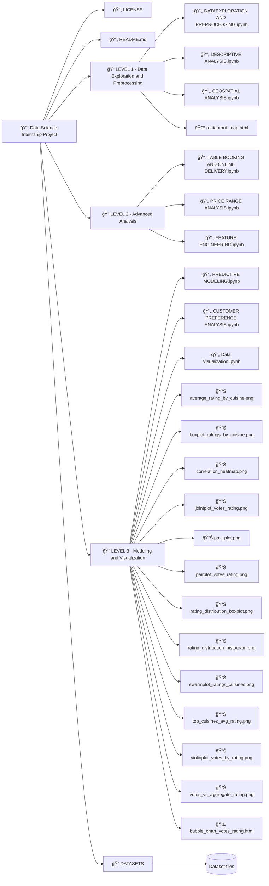

```
📦 Data Science Internship Project
│
├── 📄 LICENSE
├── 📄 README.md
│
├── 📁 LEVEL 1 - Data Exploration and Preprocessing
│   ├── 📄 DATAEXPLORATION AND PREPROCESSING.ipynb
│   ├── 📄 DESCRIPTIVE ANALYSIS.ipynb
│   ├── 📄 GEOSPATIAL ANALYSIS.ipynb
│   └── 🌐 restaurant_map.html
│
├── 📁 LEVEL 2 - Advanced Analysis
│   ├── 📄 TABLE BOOKING AND ONLINE DELEIVERY.ipynb
│   ├── 📄 PRICE RANGE ANALYSIS.ipynb
│   └── 📄 FEATURE ENGINEERING.ipynb
│
├── 📁 LEVEL 3 - Modeling and Visualization
│   ├── 📄 PREDICTIVE MODELING.ipynb
│   ├── 📄 CUSTOMER PREFERANCE ANALYSIS.ipynb
│   ├── 📄 Data Visualization.ipynb
│   ├── 📊 average_rating_by_cuisine.png
│   ├── 📊 boxplot_ratings_by_cuisine.png
│   ├── 📊 correlation_heatmap.png
│   ├── 📊 jointplot_votes_rating.png
│   ├── 📊 pair_plot.png
│   ├── 📊 pairplot_votes_rating.png
│   ├── 📊 rating_distribution_boxplot.png
│   ├── 📊 rating_distribution_histogram.png
│   ├── 📊 swarmplot_ratings_cuisines.png
│   ├── 📊 top_cuisines_avg_rating.png
│   ├── 📊 violinplot_votes_by_rating.png
│   ├── 📊 votes_vs_aggregate_rating.png
│   └── 🌐 bubble_chart_votes_rating.html
│
└── 📁 DATASETS
    └── (Dataset files)

```




# 🌟 Cognifyz Technologies: Internship Guidelines and Best Practices

## 🔹 About Cognifyz Technologies
Cognifyz Technologies is a leading technology company specializing in data science, artificial intelligence (AI), machine learning (ML), and data analytics solutions. We are committed to delivering innovative, impactful projects and offering skill-enhancing training programs that prepare professionals for industry challenges.

## 💼 Enhancing Your Professional Presence
Maximize your professional growth by sharing your achievements on LinkedIn. Highlight your offer letter, completed tasks, or internship completion certificate to showcase your experience. Ensure to tag **Cognifyz Technologies** and use these hashtags for greater reach:
- #cognifyz
- #cognifyzTech
- #cognifyzTechnologies

## 📋 Key Guidelines
1. **🔍 Maintain Academic Integrity**: Submitting original work is essential. Plagiarism or copying code may lead to termination of your internship and restrict future opportunities.
2. **🎥 Project Showcasing**:
   - Create a professional video highlighting your completed tasks and achievements.
   - Post the video on LinkedIn to establish credibility among peers.
   - Tag **Cognifyz Technologies** and use relevant hashtags for visibility.

## 🏆 Task Levels and Submission
Choose and complete any 2 out of the 3 levels below. Successfully completing **Level 3** (2 out of 4 tasks) may improve your chances of receiving a stipend.

### 🔹 Level 1: Data Exploration and Preprocessing
**Task 1**:
- 🔎 Explore the dataset and identify the number of rows and columns.
- 🚫 Check and handle missing values in the dataset.
- 🔄 Perform data type conversions if necessary.
- 📊 Analyze the distribution of the target variable (e.g., "Aggregate rating") and check for class imbalances.

### 🔹 Level 2: Descriptive Analysis
**Task 1**:
- 📈 Calculate key statistical measures (mean, median, standard deviation, etc.) for numerical columns.
- 📋 Explore the distribution of categorical variables such as "Country Code," "City," and "Cuisines."
- 🍽️ Identify the top cuisines and cities with the most restaurants.

### 🔹 Level 3: Advanced Analysis (Optional for Stipend)
- Complete any 2 out of 4 advanced tasks to qualify for the stipend.

## 📥 Submission Process
A submission form will be shared at a later date. Until then, continue your tasks and maintain separate files for each level.

## 🌐 Best Practices for LinkedIn Posts
- **📝 Create Quality Content**: Provide detailed explanations and visual evidence of your work.
- **🔖 Tagging and Hashtags**: Tag **Cognifyz Technologies** and include hashtags like #cognifyz, #cognifyzTech, and #cognifyzTechnologies.
- **🎬 Video Demonstrations**: A well-made video can significantly boost engagement and establish your credibility.

### Overview of Directories:
- **LEVEL 1**: Initial data exploration and preprocessing with geospatial visualizations.
- **LEVEL 2**: Includes feature engineering and in-depth analysis of pricing, bookings, and delivery trends.
- **LEVEL 3**: Advanced predictive modeling and visualization with detailed image outputs and plots.
- **DATASETS**: Contains all the data used for analysis.


### 📊 Data Exploration and Preprocessing

First, we need to load the data using **Pandas** for initial exploration:

```python
import pandas as pd
import matplotlib.pyplot as plt
import warnings
warnings.filterwarnings('ignore')
import seaborn as sns

# Load the dataset
file_path = r'Cognifyz-Data-Mastery-Program\DATASETS\Dataset .csv'
DATASET = pd.read_csv(file_path)

# Display the first few rows to get a sense of the data
print("Initial preview of the dataset:")
print(DATASET.head())
```

**Sample Output:**
```
Initial preview of the dataset:
   Restaurant ID         Restaurant Name  Country Code              City  \
0        6317637        Le Petit Souffle           162       Makati City   
1        6304287        Izakaya Kikufuji           162       Makati City   
2        6300002  Heat - Edsa Shangri-La           162  Mandaluyong City   
3        6318506                    Ooma           162  Mandaluyong City   
4        6314302             Sambo Kojin           162  Mandaluyong City   

                                             Address  \
0  Third Floor, Century City Mall, Kalayaan Avenu...   
1  Little Tokyo, 2277 Chino Roces Avenue, Legaspi...   
2  Edsa Shangri-La, 1 Garden Way, Ortigas, Mandal...   
3  Third Floor, Mega Fashion Hall, SM Megamall, O...   
4  Third Floor, Mega Atrium, SM Megamall, Ortigas...   

                                     Locality  \
0   Century City Mall, Poblacion, Makati City   
1  Little Tokyo, Legaspi Village, Makati City   
2  Edsa Shangri-La, Ortigas, Mandaluyong City   
3      SM Megamall, Ortigas, Mandaluyong City   
4      SM Megamall, Ortigas, Mandaluyong City   

                                    Locality Verbose   Longitude   Latitude  \
0  Century City Mall, Poblacion, Makati City, Mak...  121.027535  14.565443   
1  Little Tokyo, Legaspi Village, Makati City, Ma...  121.014101  14.553708   
2  Edsa Shangri-La, Ortigas, Mandaluyong City, Ma...  121.056831  14.581404   
3  SM Megamall, Ortigas, Mandaluyong City, Mandal...  121.056475  14.585318   
4  SM Megamall, Ortigas, Mandaluyong City, Mandal...  121.057508  14.584450   

                           Cuisines  ...          Currency Has Table booking  \
0        French, Japanese, Desserts  ...  Botswana Pula(P)               Yes   
1                          Japanese  ...  Botswana Pula(P)               Yes   
2  Seafood, Asian, Filipino, Indian  ...  Botswana Pula(P)               Yes   
3                   Japanese, Sushi  ...  Botswana Pula(P)                No   
4                  Japanese, Korean  ...  Botswana Pula(P)               Yes   
```


# 🍽️ Restaurant Dataset Analysis & Visualization

Welcome to the **Restaurant Dataset Analysis** project! 🎉 This project dives deep into a dataset containing various restaurant details. The goal is to explore, analyze, and visualize essential insights that can guide restaurant-related decisions and trends. 🍴📊

## 📚 Libraries Used

- **Pandas** 🐼: For data manipulation and analysis.
- **Matplotlib** 📈: For creating beautiful visualizations.
- **Seaborn** 🎨: For advanced and attractive plots.
- **Warnings** ⚠️: To suppress unnecessary warnings during execution.

## 🗂️ Dataset Overview

The dataset includes valuable information about restaurants such as:

- **Restaurant ID**: Unique identifier for each restaurant. 🆔
- **Country Code**: The code representing the country of the restaurant. 🌍
- **Longitude & Latitude**: Geographical coordinates. 🌐
- **Average Cost for Two**: The typical cost for a meal for two people. 💸
- **Price Range**: Price category of the restaurant. 💰
- **Aggregate Rating**: The overall rating from customers. ⭐
- **Votes**: The total number of votes the restaurant has received. 🗳️

## 📊 Basic Statistical Measures

First, we use the `describe()` method to get an overview of numerical columns, providing insights like mean, standard deviation, minimum, and maximum values.

```python
print("Basic statistical measures for numerical columns:")
print(DATASET.describe())
```

### Sample Output:
```plaintext
       Restaurant ID  Country Code    Longitude     Latitude  Average Cost for two  Price range  Aggregate Rating  Votes  
count   9,551          9,551           9,551         9,551          9,551              9,551          9,551         9,551  
mean    9,051,128      18.37           64.13         25.85          1,199              1.80           2.67         156.91  
std     8,791,521      56.75           41.47         11.00          16,121             0.91           1.52         430.17  
min     53             1.00            -157.95       -41.33         0                  1.00           0.00         0  
25%     301,962        1.00            77.08         28.48         250                1.00           2.50         5  
50%     6,004,089      1.00            77.19         28.57         400                2.00           3.20         31  
75%     18,352,290     1.00            77.28         28.64         700                2.00           3.70         131  
max     18,500,650     216.00           174.83        55.98         800,000            4.00           4.90         10,934
```

## 🎨 Distribution of Categorical Variables

We explore the distribution of key categorical columns such as **Country Code**, **City**, and **Cuisines**. We use `value_counts()` to uncover the most frequent categories.

```python
categorical_columns = ['Country Code', 'City', 'Cuisines']
for column in categorical_columns:
    print(f"\nDistribution of {column}:")
    print(DATASET[column].value_counts().head(10))
```

### Sample Output:
```plaintext
Distribution of Country Code:
Country Code
1      8,652
216    434
215    80
...

Distribution of City:
City
New Delhi      5,473
Gurgaon        1,118
Noida          1,080
...

Distribution of Cuisines:
Cuisines
North Indian                      936
North Indian, Chinese             511
Chinese                           354
...
```

### Visualizing Categorical Data 📊

We use Seaborn’s `countplot()` to visualize the distribution of categorical variables like **City** and **Cuisines**.

#### Top 10 Cuisines 🍝
```python
plt.figure(figsize=(10, 6))
sns.countplot(y='Cuisines', data=DATASET, order=DATASET['Cuisines'].value_counts().index[:10], palette='coolwarm')
plt.title("Top 10 Cuisines by Number of Restaurants")
plt.xlabel("Count")
plt.ylabel("Cuisines")
plt.show()
```

#### Top 10 Cities 🏙️
```python
plt.figure(figsize=(10, 6))
sns.countplot(y='City', data=DATASET, order=DATASET['City'].value_counts().index[:10], palette='magma')
plt.title("Top 10 Cities by Number of Restaurants")
plt.xlabel("Count")
plt.ylabel("City")
plt.show()
```

## 🥇 Top Cuisines and Cities with the Highest Number of Restaurants

### Most Common Cuisines 🍲
We find the top cuisines by the number of restaurants offering them:

```python
print("Top 10 most common cuisines:")
print(DATASET['Cuisines'].value_counts().head(10))
```

### Most Common Cities 🌆
Similarly, we explore which cities have the highest number of restaurants:

```python
print("Top 10 cities with the highest number of restaurants:")
print(DATASET['City'].value_counts().head(10))
```

