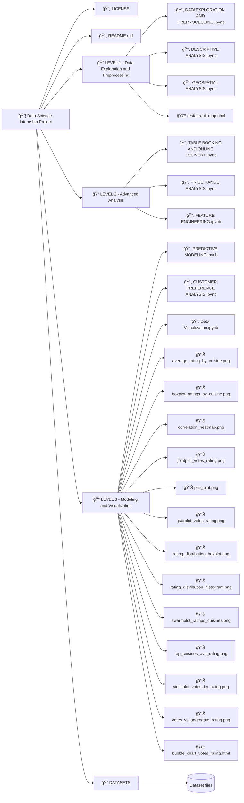

```
📦 Data Science Internship Project
│
├── 📄 LICENSE
├── 📄 README.md
│
├── 📁 LEVEL 1 - Data Exploration and Preprocessing
│   ├── 📄 DATAEXPLORATION AND PREPROCESSING.ipynb
│   ├── 📄 DESCRIPTIVE ANALYSIS.ipynb
│   ├── 📄 GEOSPATIAL ANALYSIS.ipynb
│   └── 🌐 restaurant_map.html
│
├── 📁 LEVEL 2 - Advanced Analysis
│   ├── 📄 TABLE BOOKING AND ONLINE DELEIVERY.ipynb
│   ├── 📄 PRICE RANGE ANALYSIS.ipynb
│   └── 📄 FEATURE ENGINEERING.ipynb
│
├── 📁 LEVEL 3 - Modeling and Visualization
│   ├── 📄 PREDICTIVE MODELING.ipynb
│   ├── 📄 CUSTOMER PREFERANCE ANALYSIS.ipynb
│   ├── 📄 Data Visualization.ipynb
│   ├── 📊 average_rating_by_cuisine.png
│   ├── 📊 boxplot_ratings_by_cuisine.png
│   ├── 📊 correlation_heatmap.png
│   ├── 📊 jointplot_votes_rating.png
│   ├── 📊 pair_plot.png
│   ├── 📊 pairplot_votes_rating.png
│   ├── 📊 rating_distribution_boxplot.png
│   ├── 📊 rating_distribution_histogram.png
│   ├── 📊 swarmplot_ratings_cuisines.png
│   ├── 📊 top_cuisines_avg_rating.png
│   ├── 📊 violinplot_votes_by_rating.png
│   ├── 📊 votes_vs_aggregate_rating.png
│   └── 🌐 bubble_chart_votes_rating.html
│
└── 📁 DATASETS
    └── (Dataset files)

```




# 🌟 Cognifyz Technologies: Internship Guidelines and Best Practices

## 🔹 About Cognifyz Technologies
Cognifyz Technologies is a leading technology company specializing in data science, artificial intelligence (AI), machine learning (ML), and data analytics solutions. We are committed to delivering innovative, impactful projects and offering skill-enhancing training programs that prepare professionals for industry challenges.

## 💼 Enhancing Your Professional Presence
Maximize your professional growth by sharing your achievements on LinkedIn. Highlight your offer letter, completed tasks, or internship completion certificate to showcase your experience. Ensure to tag **Cognifyz Technologies** and use these hashtags for greater reach:
- #cognifyz
- #cognifyzTech
- #cognifyzTechnologies

## 📋 Key Guidelines
1. **🔍 Maintain Academic Integrity**: Submitting original work is essential. Plagiarism or copying code may lead to termination of your internship and restrict future opportunities.
2. **🎥 Project Showcasing**:
   - Create a professional video highlighting your completed tasks and achievements.
   - Post the video on LinkedIn to establish credibility among peers.
   - Tag **Cognifyz Technologies** and use relevant hashtags for visibility.

## 🏆 Task Levels and Submission
Choose and complete any 2 out of the 3 levels below. Successfully completing **Level 3** (2 out of 4 tasks) may improve your chances of receiving a stipend.

### 🔹 Level 1: Data Exploration and Preprocessing
**Task 1**:
- 🔎 Explore the dataset and identify the number of rows and columns.
- 🚫 Check and handle missing values in the dataset.
- 🔄 Perform data type conversions if necessary.
- 📊 Analyze the distribution of the target variable (e.g., "Aggregate rating") and check for class imbalances.

### 🔹 Level 2: Descriptive Analysis
**Task 1**:
- 📈 Calculate key statistical measures (mean, median, standard deviation, etc.) for numerical columns.
- 📋 Explore the distribution of categorical variables such as "Country Code," "City," and "Cuisines."
- 🍽️ Identify the top cuisines and cities with the most restaurants.

### 🔹 Level 3: Advanced Analysis (Optional for Stipend)
- Complete any 2 out of 4 advanced tasks to qualify for the stipend.

## 📥 Submission Process
A submission form will be shared at a later date. Until then, continue your tasks and maintain separate files for each level.

## 🌐 Best Practices for LinkedIn Posts
- **📝 Create Quality Content**: Provide detailed explanations and visual evidence of your work.
- **🔖 Tagging and Hashtags**: Tag **Cognifyz Technologies** and include hashtags like #cognifyz, #cognifyzTech, and #cognifyzTechnologies.
- **🎬 Video Demonstrations**: A well-made video can significantly boost engagement and establish your credibility.

### Overview of Directories:
- **LEVEL 1**: Initial data exploration and preprocessing with geospatial visualizations.
- **LEVEL 2**: Includes feature engineering and in-depth analysis of pricing, bookings, and delivery trends.
- **LEVEL 3**: Advanced predictive modeling and visualization with detailed image outputs and plots.
- **DATASETS**: Contains all the data used for analysis.


### 📊 Data Exploration and Preprocessing

First, we need to load the data using **Pandas** for initial exploration:

```python
import pandas as pd
import matplotlib.pyplot as plt
import warnings
warnings.filterwarnings('ignore')
import seaborn as sns

# Load the dataset
file_path = r'Cognifyz-Data-Mastery-Program\DATASETS\Dataset .csv'
DATASET = pd.read_csv(file_path)

# Display the first few rows to get a sense of the data
print("Initial preview of the dataset:")
print(DATASET.head())
```

**Sample Output:**
```
Initial preview of the dataset:
   Restaurant ID         Restaurant Name  Country Code              City  \
0        6317637        Le Petit Souffle           162       Makati City   
1        6304287        Izakaya Kikufuji           162       Makati City   
2        6300002  Heat - Edsa Shangri-La           162  Mandaluyong City   
3        6318506                    Ooma           162  Mandaluyong City   
4        6314302             Sambo Kojin           162  Mandaluyong City   

                                             Address  \
0  Third Floor, Century City Mall, Kalayaan Avenu...   
1  Little Tokyo, 2277 Chino Roces Avenue, Legaspi...   
2  Edsa Shangri-La, 1 Garden Way, Ortigas, Mandal...   
3  Third Floor, Mega Fashion Hall, SM Megamall, O...   
4  Third Floor, Mega Atrium, SM Megamall, Ortigas...   

                                     Locality  \
0   Century City Mall, Poblacion, Makati City   
1  Little Tokyo, Legaspi Village, Makati City   
2  Edsa Shangri-La, Ortigas, Mandaluyong City   
3      SM Megamall, Ortigas, Mandaluyong City   
4      SM Megamall, Ortigas, Mandaluyong City   

                                    Locality Verbose   Longitude   Latitude  \
0  Century City Mall, Poblacion, Makati City, Mak...  121.027535  14.565443   
1  Little Tokyo, Legaspi Village, Makati City, Ma...  121.014101  14.553708   
2  Edsa Shangri-La, Ortigas, Mandaluyong City, Ma...  121.056831  14.581404   
3  SM Megamall, Ortigas, Mandaluyong City, Mandal...  121.056475  14.585318   
4  SM Megamall, Ortigas, Mandaluyong City, Mandal...  121.057508  14.584450   

                           Cuisines  ...          Currency Has Table booking  \
0        French, Japanese, Desserts  ...  Botswana Pula(P)               Yes   
1                          Japanese  ...  Botswana Pula(P)               Yes   
2  Seafood, Asian, Filipino, Indian  ...  Botswana Pula(P)               Yes   
3                   Japanese, Sushi  ...  Botswana Pula(P)                No   
4                  Japanese, Korean  ...  Botswana Pula(P)               Yes   
```


# 🍽️ Restaurant Dataset Analysis & Visualization

Welcome to the **Restaurant Dataset Analysis** project! 🎉 This project dives deep into a dataset containing various restaurant details. The goal is to explore, analyze, and visualize essential insights that can guide restaurant-related decisions and trends. 🍴📊

## 📚 Libraries Used

- **Pandas** 🐼: For data manipulation and analysis.
- **Matplotlib** 📈: For creating beautiful visualizations.
- **Seaborn** 🎨: For advanced and attractive plots.
- **Warnings** ⚠️: To suppress unnecessary warnings during execution.

## 🗂️ Dataset Overview

The dataset includes valuable information about restaurants such as:

- **Restaurant ID**: Unique identifier for each restaurant. 🆔
- **Country Code**: The code representing the country of the restaurant. 🌍
- **Longitude & Latitude**: Geographical coordinates. 🌐
- **Average Cost for Two**: The typical cost for a meal for two people. 💸
- **Price Range**: Price category of the restaurant. 💰
- **Aggregate Rating**: The overall rating from customers. ⭐
- **Votes**: The total number of votes the restaurant has received. 🗳️

## 📊 Basic Statistical Measures

First, we use the `describe()` method to get an overview of numerical columns, providing insights like mean, standard deviation, minimum, and maximum values.

```python
print("Basic statistical measures for numerical columns:")
print(DATASET.describe())
```

### Sample Output:
```plaintext
       Restaurant ID  Country Code    Longitude     Latitude  Average Cost for two  Price range  Aggregate Rating  Votes  
count   9,551          9,551           9,551         9,551          9,551              9,551          9,551         9,551  
mean    9,051,128      18.37           64.13         25.85          1,199              1.80           2.67         156.91  
std     8,791,521      56.75           41.47         11.00          16,121             0.91           1.52         430.17  
min     53             1.00            -157.95       -41.33         0                  1.00           0.00         0  
25%     301,962        1.00            77.08         28.48         250                1.00           2.50         5  
50%     6,004,089      1.00            77.19         28.57         400                2.00           3.20         31  
75%     18,352,290     1.00            77.28         28.64         700                2.00           3.70         131  
max     18,500,650     216.00           174.83        55.98         800,000            4.00           4.90         10,934
```

## 🎨 Distribution of Categorical Variables

We explore the distribution of key categorical columns such as **Country Code**, **City**, and **Cuisines**. We use `value_counts()` to uncover the most frequent categories.

```python
categorical_columns = ['Country Code', 'City', 'Cuisines']
for column in categorical_columns:
    print(f"\nDistribution of {column}:")
    print(DATASET[column].value_counts().head(10))
```

### Sample Output:
```plaintext
Distribution of Country Code:
Country Code
1      8,652
216    434
215    80
...

Distribution of City:
City
New Delhi      5,473
Gurgaon        1,118
Noida          1,080
...

Distribution of Cuisines:
Cuisines
North Indian                      936
North Indian, Chinese             511
Chinese                           354
...
```

### Visualizing Categorical Data 📊

We use Seaborn’s `countplot()` to visualize the distribution of categorical variables like **City** and **Cuisines**.

#### Top 10 Cuisines 🍝
```python
plt.figure(figsize=(10, 6))
sns.countplot(y='Cuisines', data=DATASET, order=DATASET['Cuisines'].value_counts().index[:10], palette='coolwarm')
plt.title("Top 10 Cuisines by Number of Restaurants")
plt.xlabel("Count")
plt.ylabel("Cuisines")
plt.show()
```

#### Top 10 Cities 🏙️
```python
plt.figure(figsize=(10, 6))
sns.countplot(y='City', data=DATASET, order=DATASET['City'].value_counts().index[:10], palette='magma')
plt.title("Top 10 Cities by Number of Restaurants")
plt.xlabel("Count")
plt.ylabel("City")
plt.show()
```

## 🥇 Top Cuisines and Cities with the Highest Number of Restaurants

### Most Common Cuisines 🍲
We find the top cuisines by the number of restaurants offering them:

```python
print("Top 10 most common cuisines:")
print(DATASET['Cuisines'].value_counts().head(10))
```

### Most Common Cities 🌆
Similarly, we explore which cities have the highest number of restaurants:

```python
print("Top 10 cities with the highest number of restaurants:")
print(DATASET['City'].value_counts().head(10))
```
# 🌍 Geospatial Restaurant Analysis

Welcome to the **Geospatial Restaurant Analysis** project! 🍽️ This project focuses on analyzing the geographical distribution of restaurants based on their **latitude** and **longitude** data, exploring patterns and concentrations of restaurant locations across different cities. 🌆

## 📚 Libraries Used

- **Folium** 🗺️: For creating interactive maps to visualize restaurant locations.
- **Pandas** 🐼: For data manipulation and processing.
- **Matplotlib** 📊: For plotting static graphs to visualize restaurant distributions.
- **Seaborn** 🎨: For enhanced visualizations and creating scatter plots.
- **Scikit-learn** 🤖: For applying machine learning algorithms like KMeans clustering to group restaurant locations.

## 🗂️ Dataset Overview

The dataset contains the following columns relevant for geospatial analysis:

- **Latitude** 📍: The latitude of the restaurant’s location.
- **Longitude** 🌍: The longitude of the restaurant’s location.
- **Restaurant Name** 🍴: The name of the restaurant.
- **City** 🏙️: The city in which the restaurant is located.

## 📍 Interactive Map of Restaurant Locations

The first step is to visualize restaurant locations on an interactive map, centered on the average latitude and longitude of all restaurants. The map includes markers for each restaurant, which can be clicked for more details.

```python
import folium
import pandas as pd
import warnings
warnings.filterwarnings('ignore')

# Load dataset
file_path = r'path_to_your_dataset.csv'
DATASET = pd.read_csv(file_path)

# Calculate average latitude and longitude
avg_lat = DATASET['Latitude'].mean()
avg_lon = DATASET['Longitude'].mean()
map_restaurants = folium.Map(location=[avg_lat, avg_lon], zoom_start=12)

# Add markers for each restaurant
for _, row in DATASET.iterrows():
    folium.Marker(
        location=[row['Latitude'], row['Longitude']],
        popup=f"{row['Restaurant Name']} - {row['City']}",
        icon=folium.Icon(color='blue', icon='cutlery', prefix='fa')
    ).add_to(map_restaurants)

# Save map to HTML
map_restaurants.save("restaurant_map.html")
```

📍 **Result**: The map has been saved as **'restaurant_map.html'**. You can open this file in any browser to view an interactive map of restaurant locations.

---

## 🌐 Distribution Analysis Using Seaborn

We can also visualize the geographical distribution of restaurants on a static map. Using **Seaborn**, we plot the density of restaurants, colored by their city:

```python
import matplotlib.pyplot as plt
import seaborn as sns

plt.figure(figsize=(12, 8))
sns.scatterplot(x='Longitude', y='Latitude', data=DATASET, hue='City', palette='Set1', legend=False)
plt.title('Geospatial Distribution of Restaurants')
plt.xlabel('Longitude')
plt.ylabel('Latitude')
plt.grid(True)
plt.show()
```

### 🔍 Insights:
- **Scatter Plot**: Displays restaurant locations with colors representing different cities.
- **Grid & Labels**: Helps understand the geographical spread and clusters of restaurants.

---

## 🔎 Geospatial Clustering (Advanced)

To identify high-density restaurant areas, we apply **KMeans clustering** using **Scikit-learn** to group restaurant locations. This can help uncover hot spots or regions with a high concentration of restaurants.

### KMeans Clustering Code:
```python
from sklearn.cluster import KMeans
import numpy as np

# Extract coordinates for clustering
coordinates = DATASET[['Latitude', 'Longitude']].dropna()

# Perform KMeans clustering
kmeans = KMeans(n_clusters=5)  # Adjust the number of clusters as needed
kmeans.fit(coordinates)

# Assign cluster labels to dataset
DATASET['Cluster'] = kmeans.predict(DATASET[['Latitude', 'Longitude']])

# Plot the clustered data
plt.figure(figsize=(12, 8))
sns.scatterplot(x='Longitude', y='Latitude', hue='Cluster', data=DATASET, palette='viridis')
plt.title('Geospatial Clustering of Restaurants')
plt.xlabel('Longitude')
plt.ylabel('Latitude')
plt.show()
```

### 🔑 Key Concepts:
- **KMeans Clustering**: Groups restaurant locations into clusters to identify regions with higher restaurant density.
- **Visualization**: Different colors represent different clusters of restaurant concentrations.
- **High-density Areas**: Clusters help reveal popular dining districts and potential new restaurant zones.

---
This **Geospatial Restaurant Analysis** gives you the tools to visualize and analyze the distribution and clustering of restaurants based on geographical data. Using **Folium** for interactive maps, **Seaborn** for static density plots, and **KMeans** clustering for grouping similar locations, we uncover important patterns:

- **Restaurant Concentration**: Where are the most popular restaurant zones?
- **Clustering**: Identifying potential high-density areas for business opportunities.
- **Outliers**: Discovering restaurants in less populated areas, which could point to underserved markets.

Geospatial analysis provides powerful insights into the spatial distribution of restaurants and can aid in making data-driven decisions for expanding or optimizing restaurant locations. 🌟


# 💸 **Price Range Analysis for Restaurants** 🍴

Welcome to the **Price Range Analysis for Restaurants** project! In this analysis, we will explore the relationship between **price range categories**, **average ratings**, and the **most common rating color** for different price ranges in the dataset. We'll help you uncover insights like which price ranges have the highest ratings and identify the color that represents the best ratings for each price range. 🎨

## 📚 Libraries Used

- **Pandas** 🐼: For data processing and manipulation.
- **Matplotlib** 📊: For plotting bar charts to visualize results.
- **Seaborn** 🎨: For creating beautiful and informative bar charts.
- **Warnings** ⚠️: To suppress unnecessary warnings during analysis.

---

## 🗂️ Dataset Overview

The dataset includes important columns for this analysis:

- **Average Cost for Two** 💸: The average cost of dining for two people.
- **Aggregate Rating** ⭐: The average rating of the restaurant.
- **Rating Color** 🌈: The color associated with the restaurant's rating.

---

## 🔢 **Price Range Categories**

We categorize restaurants into different **price ranges** based on the average cost for two people:

- **Low** 💰: Cost between ₹0 and ₹500
- **Medium** 💵: Cost between ₹501 and ₹1000
- **High** 💳: Cost between ₹1001 and ₹1500
- **Very High** 💎: Cost above ₹1500

### Create Price Range Categories:

```python
import pandas as pd
import matplotlib.pyplot as plt
import warnings
warnings.filterwarnings('ignore')
import seaborn as sns

# Load dataset
file_path = r'path_to_your_dataset.csv'
DATASET = pd.read_csv(file_path)

# Create price range categories
DATASET['Price Range Category'] = pd.cut(DATASET['Average Cost for two'], bins=[0, 500, 1000, 1500, 5000], labels=['Low', 'Medium', 'High', 'Very High'])
```

### 📊 **Most Common Price Range**

We calculate the most common price range based on the number of restaurants in each category:

```python
most_common_price_range = DATASET['Price Range Category'].value_counts()
print("Most common price range:")
print(most_common_price_range)

# Plot the distribution of price ranges
plt.figure(figsize=(10, 5))
sns.barplot(x=most_common_price_range.index, y=most_common_price_range.values, palette='Set2')
plt.title('Most Common Price Range')
plt.xlabel('Price Range Category')
plt.ylabel('Number of Restaurants')
plt.show()
```

### Insights:
- **Low Price Range** 💰: Most common range, with 6056 restaurants.
- **Very High Price Range** 💎: Least common, with only 552 restaurants.

---

## ⭐ **Average Rating for Each Price Range**

Now we calculate the **average rating** for each price range category to understand how ratings vary across price ranges:

```python
avg_rating_per_price_range = DATASET.groupby('Price Range Category')['Aggregate rating'].mean().round(2)
print("Average rating for each price range:")
print(avg_rating_per_price_range)

# Plot the average rating for each price range
plt.figure(figsize=(10, 5))
sns.barplot(x=avg_rating_per_price_range.index, y=avg_rating_per_price_range.values, palette='Blues')
plt.title('Average Rating for Each Price Range')
plt.xlabel('Price Range Category')
plt.ylabel('Average Rating')
plt.ylim(0, 5)  # Set y-axis limit for ratings
plt.show()
```

### Insights:
- **Low Price Range** 💰: Average rating of 2.32.
- **Very High Price Range** 💎: Highest average rating of 3.67.

---

## 🌈 **Color Representing the Highest Average Rating**

Next, we identify the **color** representing the highest average rating for each price range:

```python
highest_avg_color_per_price_range = DATASET.groupby('Price Range Category')['Rating color'].agg(lambda x: x.value_counts().idxmax())
print("Color representing the highest average rating for each price range:")
print(highest_avg_color_per_price_range)

# Plot the color associated with the highest average rating
plt.figure(figsize=(10, 5))
sns.barplot(x=highest_avg_color_per_price_range.index, y=avg_rating_per_price_range.values, palette=highest_avg_color_per_price_range.values)
plt.title('Color Representing Highest Average Rating by Price Range')
plt.xlabel('Price Range Category')
plt.ylabel('Average Rating')
plt.show()
```

### Insights:
- **Low Price Range** 💰: Orange 🌟 color represents the highest rating.
- **Medium Price Range** 💵: Orange 🌟 color again represents the highest rating.
- **Very High Price Range** 💎: Yellow 🌟 color is associated with the highest ratings.

---

Through this **Price Range Analysis** for restaurants, we have learned the following key insights:

1. **Most Common Price Range**: Restaurants in the **Low Price Range** 💰 are the most common.
2. **Average Ratings**: **Very High Price Range** 💎 restaurants tend to have the highest average ratings.
3. **Color Insights**: The color **Orange** 🌟 represents the highest average ratings for **Low** and **Medium** price ranges, while **Yellow** 🌟 is most common for **Very High** price ranges.

This analysis can help us understand how price influences customer ratings and how restaurants are perceived across different price ranges. 🎯


# Table Booking and Online Delivery Analysis

**1. Percentage of Restaurants Offering Table Booking and Online Delivery**

- **Percentage of Restaurants Offering Table Booking:**

```python
table_booking_percentage = (DATASET['Has Table booking'].value_counts(normalize=True) * 100).round(2)
print("Percentage of restaurants with and without table booking:")
print(table_booking_percentage)
```

**Output:**
```
Percentage of restaurants with and without table booking:
Has Table booking
No     87.88
Yes    12.12
Name: proportion, dtype: float64
```

- **Percentage of Restaurants Offering Online Delivery:**

```python
online_delivery_percentage = (DATASET['Has Online delivery'].value_counts(normalize=True) * 100).round(2)
print("\nPercentage of restaurants with and without online delivery:")
print(online_delivery_percentage)
```

**Output:**
```
Percentage of restaurants with and without online delivery:
Has Online delivery
No     74.34
Yes    25.66
Name: proportion, dtype: float64
```

**Plot for Distribution:**

```python
plt.figure(figsize=(8, 5))
sns.countplot(x='Has Table booking', data=DATASET, palette='pastel')
plt.title('Distribution of Restaurants with Table Booking')
plt.xlabel('Table Booking Available')
plt.ylabel('Number of Restaurants')
plt.grid(axis='y', linestyle='--', alpha=0.5)
plt.show()

sns.countplot(x='Has Online delivery', data=DATASET, palette='coolwarm')
plt.title('Distribution of Restaurants with Online Delivery')
plt.xlabel('Online Delivery Available')
plt.ylabel('Number of Restaurants')
plt.grid(axis='y', linestyle='--', alpha=0.5)
plt.show()
```

**Explanation:**
- The `value_counts(normalize=True)` method calculates the relative frequency of each category.
- A `countplot` is used to visualize how many restaurants offer Table Booking and Online Delivery.

**2. Compare Average Ratings Based on Table Booking Availability**

```python
avg_rating_with_table_booking = DATASET[DATASET['Has Table booking'] == 'Yes']['Aggregate rating'].mean()
avg_rating_without_table_booking = DATASET[DATASET['Has Table booking'] == 'No']['Aggregate rating'].mean()

print("Average rating of restaurants with table booking:", round(avg_rating_with_table_booking, 2))
print("Average rating of restaurants without table booking:", round(avg_rating_without_table_booking, 2))
```

**Output:**
```
Average rating of restaurants with table booking: 3.44
Average rating of restaurants without table booking: 2.56
```

**Plot for Boxplot:**

```python
plt.figure(figsize=(10, 6))
sns.boxplot(x='Has Table booking', y='Aggregate rating', data=DATASET, palette='muted')
plt.title('Impact of Table Booking on Aggregate Rating')
plt.xlabel('Table Booking Available')
plt.ylabel('Aggregate Rating')
plt.grid(axis='y', linestyle='--', alpha=0.5)
plt.show()
```

**Explanation:**
- This compares the average ratings for restaurants that offer table booking with those that do not, using a boxplot for better visualization.

**3. Analyze Online Delivery Availability by Price Range**

```python
DATASET['Price Range Category'] = pd.cut(DATASET['Average Cost for two'], bins=[0, 500, 1000, 1500, 5000], labels=['Low', 'Medium', 'High', 'Very High'])
online_delivery_by_price = DATASET.groupby('Price Range Category')['Has Online delivery'].value_counts(normalize=True).unstack().fillna(0) * 100
print("Percentage of restaurants offering online delivery by price range:")
print(online_delivery_by_price.round(2))
```

**Output:**
```
Percentage of restaurants offering online delivery by price range:
Has Online delivery      No    Yes
Price Range Category              
Low                   82.12  17.88
Medium                54.91  45.09
High                  64.81  35.19
Very High             77.90  22.10
```

**Plot for Stacked Bar Chart:**

```python
online_delivery_by_price.plot(kind='bar', stacked=True, figsize=(10, 6), colormap='viridis')
plt.title('Online Delivery Availability by Price Range')
plt.xlabel('Price Range Category')
plt.ylabel('Percentage (%)')
plt.legend(title='Online Delivery Available')
plt.show()
```

**Explanation:**
- The dataset is categorized into price ranges, and the percentage of restaurants offering online delivery is calculated for each category.
- A stacked bar chart visualizes the distribution of online delivery services across different price ranges.


# **Feature Engineering for Restaurant Dataset 🍽️**

## **Introduction 🎯**

Feature Engineering is a crucial step in enhancing the predictive power of machine learning models. It involves creating new features or modifying existing ones to better represent the underlying patterns in the data. This process helps improve model performance by providing additional useful information derived from raw data. 📊

In this analysis, we explore how feature engineering can be applied to a restaurant dataset by creating new features and encoding categorical variables for easier model interpretation. 🔍

## **Dataset Overview 📋**

The dataset used in this analysis contains restaurant information, including details such as:

- **Restaurant Name 🏢**
- **Address 📍**
- **Has Table Booking 📅**
- **Has Online Delivery 🚗**
- **Average Cost for Two 💸**
- **Aggregate Rating ⭐**

We will focus on transforming and encoding some key columns to generate new insights. 💡

## **Feature Engineering Steps ⚙️**

### 1. **Extracting Features: Length of Restaurant Name and Address 📝**

We begin by creating new features that capture the length of the restaurant's name and the address. These features may provide insights into the level of detail in the restaurant's branding and location. 🏷️

#### **Code:**
```python
# Create new features for the length of the restaurant name and address
DATASET['Restaurant Name Length'] = DATASET['Restaurant Name'].apply(len)
DATASET['Address Length'] = DATASET['Address'].apply(len)

# Display the new columns for verification
print("Sample data with new length features:")
print(DATASET[['Restaurant Name', 'Restaurant Name Length', 'Address', 'Address Length']].head())
```

#### **Sample Data:**

| Restaurant Name        | Restaurant Name Length | Address                                             | Address Length |
|------------------------|------------------------|-----------------------------------------------------|----------------|
| Le Petit Souffle       | 16                     | Third Floor, Century City Mall, Kalayaan Avenue...  | 71             |
| Izakaya Kikufuji       | 16                     | Little Tokyo, 2277 Chino Roces Avenue, Legaspi...   | 67             |
| Heat - Edsa Shangri-La | 22                     | Edsa Shangri-La, 1 Garden Way, Ortigas, Mandaluyong | 56             |
| Ooma                   | 4                      | Third Floor, Mega Fashion Hall, SM Megamall, Ortigas| 70             |
| Sambo Kojin            | 11                     | Third Floor, Mega Atrium, SM Megamall, Ortigas...   | 64             |

### 2. **Visualizing the Length Features 📊**

We plot the distributions of restaurant name length and address length to understand their variations. 📈

#### **Code:**
```python
# Plot distribution of 'Restaurant Name Length'
plt.figure(figsize=(12, 6))
sns.histplot(DATASET['Restaurant Name Length'], kde=True, color='GREEN')
plt.title('Distribution of Restaurant Name Length')
plt.xlabel('Length of Restaurant Name')
plt.ylabel('Frequency')
plt.show()

# Plot distribution of 'Address Length'
plt.figure(figsize=(12, 6))
sns.histplot(DATASET['Address Length'], kde=True, color='orange')
plt.title('Distribution of Address Length')
plt.xlabel('Length of Address')
plt.ylabel('Frequency')
plt.show()
```

### 3. **Encoding Categorical Variables: Table Booking and Online Delivery 🧮**

Next, we encode the categorical features "Has Table Booking" and "Has Online Delivery" into binary numerical values. This transformation helps to use these features in predictive models. 🔢

#### **Code:**
```python
# Encoding 'Has Table booking' as a binary feature
DATASET['Has Table Booking (Encoded)'] = DATASET['Has Table booking'].map({'Yes': 1, 'No': 0})

# Encoding 'Has Online delivery' as a binary feature
DATASET['Has Online Delivery (Encoded)'] = DATASET['Has Online delivery'].map({'Yes': 1, 'No': 0})
print("Sample data with new encoded features:")
print(DATASET[['Has Table booking', 'Has Table Booking (Encoded)', 'Has Online delivery', 'Has Online Delivery (Encoded)']].head())
```

#### **Sample Data:**

| Has Table booking | Has Table Booking (Encoded) | Has Online delivery | Has Online Delivery (Encoded) |
|-------------------|-----------------------------|---------------------|-------------------------------|
| Yes               | 1                           | No                  | 0                             |
| Yes               | 1                           | No                  | 0                             |
| Yes               | 1                           | No                  | 0                             |
| No                | 0                           | No                  | 0                             |
| Yes               | 1                           | No                  | 0                             |

### 4. **Visualizing the Encoded Features 📊**

We visualize the distribution of the binary encoded features to understand the proportion of restaurants offering table booking and online delivery. 📅📦

#### **Code:**
```python
# Visualize the proportion of restaurants with table booking
plt.figure(figsize=(8, 5))
sns.countplot(x='Has Table Booking (Encoded)', data=DATASET, palette='pastel')
plt.title('Distribution of Restaurants with Table Booking')
plt.xlabel('Has Table Booking (Encoded)')
plt.ylabel('Count')
plt.xticks([0, 1], ['No', 'Yes'])
plt.show()

# Visualize the proportion of restaurants with online delivery
plt.figure(figsize=(8, 5))
sns.countplot(x='Has Online Delivery (Encoded)', data=DATASET, palette='coolwarm')
plt.title('Distribution of Restaurants with Online Delivery')
plt.xlabel('Has Online Delivery (Encoded)')
plt.ylabel('Count')
plt.xticks([0, 1], ['No', 'Yes'])
plt.show()
```

## **Summary of Feature Engineering 🔧**

### **New Features Created:**
1. **Restaurant Name Length 📝:** The number of characters in the restaurant's name.
2. **Address Length 📍:** The number of characters in the restaurant's address.

### **Categorical Features Encoded:**
1. **Has Table Booking (Encoded) 📅:** Binary variable (1 for Yes, 0 for No) indicating whether a restaurant offers table booking.
2. **Has Online Delivery (Encoded) 🚗:** Binary variable (1 for Yes, 0 for No) indicating whether a restaurant offers online delivery.

### **Visual Insights:**
- The distribution of the length of restaurant names and addresses shows variations in branding and location descriptions. 🌍
- The encoded features reveal the proportion of restaurants offering table booking and online delivery services. 📅📦


### 1. **Data Preparation** 📊

- **Loading the Dataset**: First, we load the dataset using pandas.
  
```python
import pandas as pd
import matplotlib.pyplot as plt
from sklearn.model_selection import train_test_split
from sklearn.preprocessing import LabelEncoder
import warnings
warnings.filterwarnings('ignore')
import seaborn as sns

file_path = r'Cognifyz-Data-Mastery-Program\DATASETS\Dataset .csv'
DATASET = pd.read_csv(file_path)
```

- **Drop Irrelevant Columns**: Drop columns that aren't useful for prediction, like `Restaurant Name`, `Address`, `Locality`, `Longitude`, and `Latitude`.

```python
# Drop irrelevant columns
data = DATASET.drop(columns=['Restaurant Name', 'Address', 'Locality', 'Longitude', 'Latitude'])
```

- **Label Encoding**: For categorical columns such as `Price Range Category`, we use Label Encoding to convert them into numeric values.

```python
label_encoder = LabelEncoder()
data['Price Range Category'] = label_encoder.fit_transform(data['Price Range Category'])
```

- **Selecting Relevant Features**: We now select the features (X) and target variable (y) for the model.

```python
# Select features (X) and target (y)
X = DATASET[['Price Range Category', 'Average Cost for two', 'Has Table booking', 'Has Online delivery', 'Votes']]
y = DATASET['Aggregate rating']
```

- **Train-Test Split**: Split the data into training and testing sets (80% training, 20% testing).

```python
X_train, X_test, y_train, y_test = train_test_split(X, y, test_size=0.2, random_state=42)
```

---

### 2. **Model Building** 🤖

We will experiment with the following three models:

- **Linear Regression**  
- **Decision Tree Regressor**  
- **Random Forest Regressor**

#### **Linear Regression Model**:
```python
from sklearn.linear_model import LinearRegression

# Instantiate and train the Linear Regression model
lr_model = LinearRegression()
lr_model.fit(X_train, y_train)

# Predict on the test set
lr_pred = lr_model.predict(X_test)
```

#### **Decision Tree Regressor**:
```python
from sklearn.tree import DecisionTreeRegressor

# Instantiate and train the Decision Tree model
dt_model = DecisionTreeRegressor(random_state=42)
dt_model.fit(X_train, y_train)

# Predict on the test set
dt_pred = dt_model.predict(X_test)
```

#### **Random Forest Regressor**:
```python
from sklearn.ensemble import RandomForestRegressor

# Instantiate and train the Random Forest model
rf_model = RandomForestRegressor(n_estimators=100, random_state=42)
rf_model.fit(X_train, y_train)

# Predict on the test set
rf_pred = rf_model.predict(X_test)
```

---

### 3. **Model Evaluation** 📈

We will evaluate each model using the following metrics:

- **R-Squared**: Measures how well the model explains the variance in the target variable. (Higher is better)
- **Mean Squared Error (MSE)**: Measures the average squared difference between predicted and actual values. (Lower is better)

```python
from sklearn.metrics import mean_squared_error, r2_score

# Linear Regression evaluation
lr_r2 = r2_score(y_test, lr_pred)
lr_mse = mean_squared_error(y_test, lr_pred)

# Decision Tree evaluation
dt_r2 = r2_score(y_test, dt_pred)
dt_mse = mean_squared_error(y_test, dt_pred)

# Random Forest evaluation
rf_r2 = r2_score(y_test, rf_pred)
rf_mse = mean_squared_error(y_test, rf_pred)

# Print the results
print("Linear Regression - R2:", lr_r2, "MSE:", lr_mse)
print("Decision Tree - R2:", dt_r2, "MSE:", dt_mse)
print("Random Forest - R2:", rf_r2, "MSE:", rf_mse)
```

The results will likely show that Random Forest performs better due to its ability to handle non-linearity and interactions in the data.

---

### 4. **Compare the Models** 🤔

Compare the performance of the models based on **R-squared** and **MSE**:

- **R-squared**: The closer it is to 1, the better the model fits the data.
- **MSE**: The smaller it is, the more accurate the model.

You will typically see that Random Forest will have the highest R-squared and the lowest MSE.

---

### 5. **Feature Importance (Random Forest)** 🔑

Random Forest allows us to visualize which features are contributing the most to predicting the target variable (`Aggregate rating`).

```python
importances = rf_model.feature_importances_
sorted_idx = importances.argsort()

# Plot feature importance
plt.figure(figsize=(10, 6))
plt.barh(X.columns[sorted_idx], importances[sorted_idx])
plt.title("Feature Importance (Random Forest)")
plt.xlabel("Feature Importance")
plt.show()
```

This plot will give you an idea of which features have the most significant impact on predicting restaurant ratings.

---

### 6. **Hyperparameter Tuning for Decision Tree and Random Forest** 🛠️

We can use **GridSearchCV** to find the best hyperparameters for the models. Here's an example for Random Forest:

```python
from sklearn.model_selection import GridSearchCV

# Define the hyperparameter grid for Random Forest
param_grid_rf = {
    'n_estimators': [50, 100, 200],
    'max_depth': [None, 10, 20, 30],
    'min_samples_split': [2, 5, 10],
    'max_features': ['auto', 'sqrt', 'log2']
}

# Initialize GridSearchCV
grid_search_rf = GridSearchCV(estimator=rf_model, param_grid=param_grid_rf, cv=5, scoring='neg_mean_squared_error', n_jobs=-1, verbose=2)

# Fit the model
grid_search_rf.fit(X_train, y_train)

# Get the best hyperparameters
print("Best hyperparameters for Random Forest:", grid_search_rf.best_params_)
```

Once we find the best hyperparameters, we use the tuned model to predict:

```python
# Use the best model to predict
best_rf_model = grid_search_rf.best_estimator_
rf_pred_tuned = best_rf_model.predict(X_test)

# Evaluate the tuned Random Forest model
rf_r2_tuned = r2_score(y_test, rf_pred_tuned)
rf_mse_tuned = mean_squared_error(y_test, rf_pred_tuned)

print("Tuned Random Forest - R2:", rf_r2_tuned, "MSE:", rf_mse_tuned)
```

---

### 7. **Model Residual Analysis** 🔍

Residual analysis helps check the model’s performance and if it's underfitting or overfitting.

```python
# Calculate residuals for the Random Forest model (or any other model)
residuals_rf = y_test - rf_pred_tuned

# Plot residuals
plt.figure(figsize=(10, 6))
plt.scatter(y_test, residuals_rf, color='blue', edgecolor='k', alpha=0.7)
plt.axhline(y=0, color='red', linestyle='--')
plt.title('Residuals vs Actual Values (Random Forest)')
plt.xlabel('Actual Aggregate Rating')
plt.ylabel('Residuals')
plt.show()

# Histogram of residuals
plt.figure(figsize=(10, 6))
plt.hist(residuals_rf, bins=20, color='green', edgecolor='black', alpha=0.7)
plt.title('Distribution of Residuals (Random Forest)')
plt.xlabel('Residuals')
plt.ylabel('Frequency')
plt.show()
```

---

### 8. **Model Interpretability (SHAP or LIME)** 🌟

If you want to understand how the model makes predictions, you can use **SHAP** or **LIME** for interpretability.

Here's how to use **SHAP** for the Random Forest model:

```python
import shap

# Create the SHAP explainer
explainer = shap.TreeExplainer(best_rf_model)

# Calculate SHAP values for the test set
shap_values = explainer.shap_values(X_test)

# Plot summary of SHAP values
shap.summary_plot(shap_values, X_test)
```

This summary plot will show you how much each feature contributes to each individual prediction.


By the end of this process, you will have built, evaluated, and tuned three regression models: **Linear Regression**, **Decision Tree**, and **Random Forest**. Random Forest is likely to be the best-performing model due to its ability to handle complex relationships in the data. You will also have visualized feature importance, performed residual analysis, and used SHAP for model interpretability.


Feature engineering has provided us with insightful new features and encoded variables that can be used in predictive models. These transformations help capture meaningful patterns and relationships, making the data more suitable for machine learning algorithms. 💻

By understanding and applying these techniques, you can significantly improve the performance of your models and gain deeper insights into the data. 🚀
